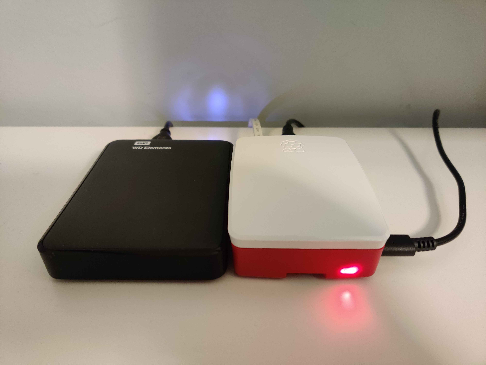

# minidepot: a small backup server



Minidepot is a self-maintaining backup server running on a
[Raspberry Pi 4](https://www.raspberrypi.org/products/raspberry-pi-4-model-b/).
Just add a hard drive and Internet, and minidepot will be available on the URL of your choice.

A short list of features:

- A [Restic](https://github.com/restic/restic) [REST server](https://github.com/restic/rest-server)
  backend for encrypted, deduplicated, incremental backups.
- Systemd services to automatically copy backup snapshots to an offsite source every day,
  as well as prune both local and offsite sources according to a set retention policy twice a month -- almost no
  manual maintenance required.
- Dynamic DNS client that updates a DNS record in CloudFlare to with its IP address -- so
  long as it has an Internet connection, minidepot will always be accessible via a specified URL
  (some port forwarding required).
- Automatic SSL certificates provided by [Let's Encrypt](https://letsencrypt.org/) for authenticated
  HTTPS connections to the backup repository.
- Secrets managed and provisioned by [sops-nix](https://github.com/Mic92/sops-nix).

All this packaged in a reproducible [NixOS](https://nixos.org) configuration.

## Structure

This repository is a Nix flake to ensure as much reproducibility as possible,
and provides two outputs: minidepot's NixOS configuration, and a shell for managing secrets with sops.
See for yourself: if you have a flakes-enabled Nix installation, run
```
$ nix flake show github:i077/minidepot
```
Secrets are managed and stored in `secrets/`.
Public keys for which those secrets are encrypted are in `secrets/pubkeys`.
All the NixOS modules are stored in `modules/`.
I separated functionality to be as modular as possible, so each .nix file focuses on doing just one thing:
- [`base.nix`](./modules/base.nix): Base configuration for the Raspberry Pi to boot and login.
- [`hardware-configuration.nix`](./modules/hardware-configuration.nix): Hardware configuration generated by `nixos-generate-config`.
- [`sshd.nix`](./modules/sshd.nix): OpenSSH configuration so the Pi can be SSH'd into.
- [`restic-server.nix`](./modules/restic-server.nix): The backup server, and associated services to maintain it.
- [`dyndns.nix`](./modules/dyndns.nix): A service to run a dynamic DNS script to update a DNS A record in CloudFlare.
  This functionality is provided by a fish script at `dyndns.fish`.
- [`ssl.nix`](./modules/ssl.nix): Configuration for the ACME service to request and renew the SSL certificate for the domain.
